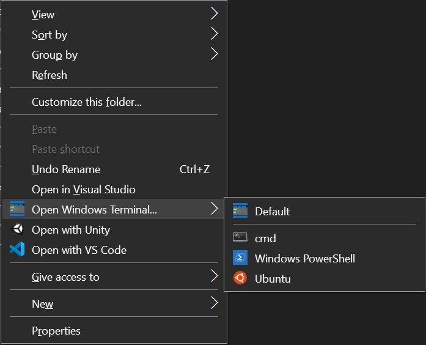

# Windows Terminal File Explorer Context Menu

This registry script adds a context menu option to open the `Windows Terminal` app
in the Windows File Explorer when you right-click on a folder or the empty space in the folder.

It provides a sub-menu to select different terminal profiles, such as `cmd`, `PowerShell`,
`Ubuntu`, etc. For now, these options are hardcoded in the registry script file.


## Installation

1. Download the files from this repository into a temporary folder.

2. Open the `OpenWindowsTerminalHere.reg` script file.
Replace all instance of `%LOCALAPPDATA%` with `C:\\Users\\<username>\\AppData\\Local`.
This step is necessary for now as Windows does not seem to be able to open the app
with `%LOCALAPPDATA%` in its path in the registry.

3. You may wish to backup your Windows Registry at this point in case anything goes wrong.
See https://support.microsoft.com/en-sg/help/322756/how-to-back-up-and-restore-the-registry-in-windows

4. Right-click on the .reg file in File Explorer and select `Merge` to merge the registry entries with
your Windows Registry. You may need to grant admin permission to allow this and confirm
this action when a confirmation window appears. When this is completed, you will get another
pop-up window indicating this.

5. Copy the icon files (`*.ico`) from the `resources` folder to the folder containing the
`Windows Terminal` application (`wt.exe`). e.g.,

```
C:\Users\<username>\AppData\Local\Microsoft\WindowsApps\Microsoft.WindowsTerminal_8wekyb3d8bbwe\
```

This path must match the `Icon=` entries in the .reg file.

## Usage

In Windows File Explorer, right click on any folder or if you are already in the folder you want, right click on any blank space within the folder.

A context menu showing the `Open Windows Terminal...` option will appear. Expand it to see the different shell profiles you can use.



